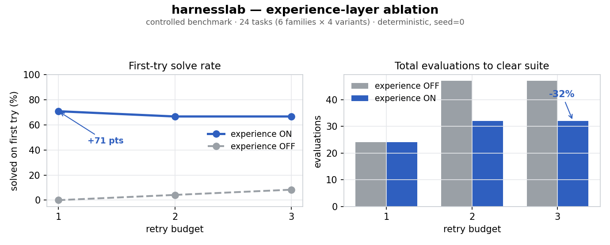

# harnesslab

**A self-evolving, model-agnostic agent harness.**

> **English** · [中文](README.zh-CN.md)

> *Model + Harness = Agent.* This is the **harness** half — the scaffolding that lives
> *outside* the model and turns a capable LLM into an agent that **learns from its own
> runs** instead of repeating its own mistakes.

`harnesslab` is a small, dependency-light toolkit for the parts of an agent the model
doesn't give you for free: long-term memory that doesn't go stale, an experience layer
that distills lessons from failures and reinjects them, multi-agent orchestration and
adversarial self-verification, a unified tool/simulation gateway that records every call,
a closed-loop optimizer, and a reproducible **evaluation harness** that measures whether
any of it actually helps.

It is distilled *clean-room and domain-neutral* from a production analog-IC design agent
whose experience layer warm-started a CMA-ES / GP optimizer across a **154-netlist
benchmark** and a **60+ paper reproduction suite**. No product, customer, or
infrastructure code is included — only the general method.

Core is **stdlib-only**. 47 tests, every component swappable behind a plain callable.

---

## The problem

The gap between a model's raw capability and an agent's real-world performance is mostly
*harness*, not weights. Three failure modes recur:

1. **The agent repeats its own mistakes.** Each run starts cold; yesterday's hard-won
   lesson is gone.
2. **Long-term memory rots.** Notes that referenced a file, symbol, or endpoint linger
   long after that artifact moved — and the agent acts on advice that is no longer true.
3. **Nobody measures the harness.** Harness changes ship on vibes because there's no
   before/after on a real task suite.

`harnesslab` takes all three as first-class, testable concerns.

## The self-evolving loop

```
        ┌─────────── retrieve relevant lessons (anti-stale memory) ──────────┐
        │                                                                    ▼
  ExperienceStore                                                       attempt task
        ▲                                                                    │
        └──────── record outcome ◄── distill lesson ◄── (on failure) ────────┘
```

`record → distill-on-failure → retrieve` is what makes the harness *self-evolving*: the
agent improves at a **task family** with zero model retraining. Failures are nudged up
the retrieval ranking on purpose — they carry the actionable lessons.

## What's here (v0.3)

| Module | What it does | Maps to (agent-harness topic) |
|---|---|---|
| `experience` | Self-evolving episode store: record → distill-on-failure → retrieve warm-start seeds; `solve_with_experience()` runs the loop. | self-evolving agent, experience replay |
| `memory` | File-based long-term memory with **anti-staleness** recall — drops advice whose referenced artifacts no longer resolve (pluggable validator). | long-term memory |
| `context` | Token-budget-aware context assembly: pinned anchors always survive, overflow is compacted not dropped; `reground()` re-injects the goal each phase. | context management, long-horizon |
| `orchestration` | `fan_out` / `pipeline` / `judge_panel` — concurrent subagents, order-preserving, per-item failure isolation. | subagent / multi-agent |
| `review` | Adversarial self-verification: N-skeptic `refute_vote` and a `writer → critic → judge` loop. | reliability, self-verification |
| `bias` | Divergence tools: `diverse_sample` (no two candidates too alike) and `lenses` (one per framing) — defeat premature convergence. | research taste, exploration |
| `flows` | Staged flows with mandatory **gates**, plus a `scored_review` gate (ship only when the weakest dimension clears the bar). | planning, reliability |
| `recover` | `with_recovery`: retry with diagnosis, escalate only after N *informed* failures. | self-healing, robustness |
| `skills` | Skill router + a recipe library (persist a *working procedure*, replay it on similar tasks). | skills, planning |
| `gateway` | One door for every tool/sim call; **records each call**, distills failures into experience. | tool use, observability |
| `optimize` | Self-adapting (1+λ) evolution strategy (Rechenberg 1/5 rule) — a closed-loop optimizer driving an agent against any evaluator. | closed-loop search |
| `evaluation` | A reproducible ablation that measures whether the experience layer helps. | benchmark / eval |
| `llm` | Thin model-agnostic adapter; any OpenAI-compatible endpoint, **DeepSeek out of the box**. | model plumbing |

## How it fits together

```
   task ─▶ skills.route ─▶ orchestration (fan-out / pipeline / judge_panel) ─▶ gateway.call ──▶ tools / sims
              │                     │                                              │
              │               review.verify  ◀─ adversarial self-check             │ every call recorded
              ▼                     │                                              ▼
        recipes.find                ▼                                   experience.record ◀─ distill failures
              └──────────▶ warm-start next attempt ◀── retrieve lessons (anti-stale memory) ──┘
```

## Evaluation

Does the experience layer actually help? A harness claim is only worth a measured
before/after, so here is one — a **controlled, reproducible ablation** (deterministic, no
API key). The agent is a *transparent simulated solver* (behaviour stated in
[`evaluation.py`](harnesslab/evaluation.py)); the **same harness** drives a real LLM via
the wiring in [`bench/ablation.py`](bench/ablation.py).



*Reproduce the figure: `python bench/plot_ablation.py`*

Setup: 6 families × 4 variants = 24 tasks; variants in a family share one hidden "trick".
**OFF** gives each task its own store (solve it cold); **ON** shares one store across the
suite, so a lesson learned on one variant transfers to its siblings. Same RNG seed both
modes.

| retries | mode | first-try solve | final solve | total evaluations |
|:--:|:--:|:--:|:--:|:--:|
| 1 | OFF | **0%** | 0% | 24 |
| 1 | ON | **71%** | 71% | 24 |
| 2 | OFF | 4% | 92% | 47 |
| 2 | ON | 67% | 100% | **32** |
| 3 | OFF | 8% | 100% | 47 |
| 3 | ON | 67% | 100% | **32** |

Read it two ways:

- **With one shot (retries=1)**, experience transfer is the difference between solving and
  not: **0% → 71%** first-try. Cross-task memory *is* the capability here.
- **With retries to spare (retries=3)**, both eventually solve — but transfer makes it
  efficient: **first-try 8% → 67%** and **−32% total evaluations**.

Reproduce:

```bash
python bench/ablation.py --rounds 3        # deterministic; seed with --seed
```

## Quickstart

```bash
python examples/quickstart.py     # no network, no keys
pytest -q                         # 47 tests
```

```python
from harnesslab import ExperienceStore, solve_with_experience

store = ExperienceStore("exp.jsonl")

def solver(task, seed):                 # seed = warm-start lessons from prior runs
    ...                                  # your agent; returns (success, summary, lesson)

ok, last = solve_with_experience("size a 1.2V bandgap", solver, store, max_rounds=3)
```

Anti-staleness, multi-agent verification, and a recorded tool gateway in a few lines:

```python
from harnesslab import Memory, MemoryStore, refute_vote, Gateway

mem = MemoryStore("memory/")
mem.write(Memory(name="ldo-trim", description="how the LDO trim works",
                 body="Set the 6-bit trim before measuring.", refs=["src/ldo.py"]))
mem.recall("ldo trim")          # silently skips memories gone stale; mem.stale() lists them

refute_vote("this design meets spec", skeptic=my_llm_skeptic, n=3)   # survives only if a majority can't refute

gw = Gateway(experience=store)  # every tool call recorded; failures become lessons
gw.register("simulate", run_my_sim)
gw.call("simulate", netlist=...)
```

## Roadmap

- [x] Experience replay + anti-stale memory
- [x] Multi-agent orchestration + adversarial self-verification
- [x] Unified recorded tool/sim gateway + closed-loop optimizer
- [x] Reproducible evaluation harness with an ablation
- [x] Long-context management, divergence/anti-bias, flow gates, self-healing recovery
- [ ] Real-LLM ablation numbers (the harness already runs it; needs an endpoint + key)
- [ ] Embedding-backed similarity + LLM-backed distiller as drop-in adapters
- [ ] A `cma` / GP surrogate backend behind `optimize()`

## Design notes

- **Model-agnostic by construction.** The model is a `str -> str` callable; nothing in
  the harness assumes a vendor.
- **Boring storage on purpose.** Append-only JSONL and one-file-per-memory are diffable,
  greppable, trivial to inspect — the harness is never a black box.
- **Clean-room.** Every pattern is reimplemented from scratch; no code is lifted from the
  production system the methods were learned in.

## License

MIT © Wenzhen Li (李文振)
