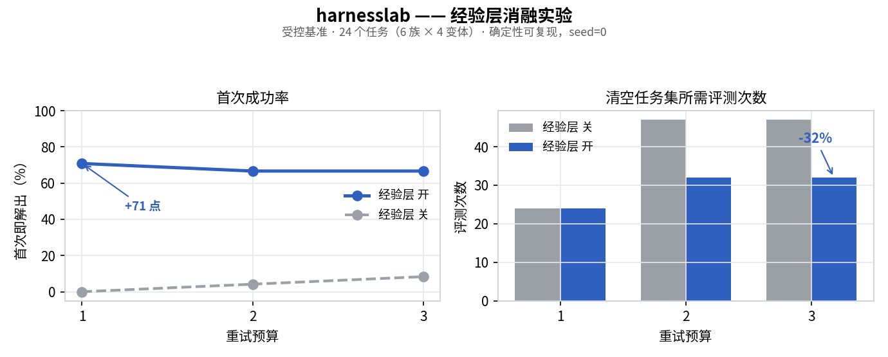

# harnesslab

[](https://github.com/primorLee/harnesslab/actions/workflows/ci.yml) [](LICENSE) 

**一个自进化（self-evolving）、与模型无关（model-agnostic）的 agent harness（智能体执行框架）。**

> [English](README.md) · **中文**

> *Model + Harness = Agent.* 这里做的是 **harness（执行框架）** 那一半 —— 活在模型*之外*、把一个有能力的 LLM（大语言模型）变成**能从自己的运行中学习**、而不是反复重蹈覆辙的 agent 的那层脚手架。

`harnesslab` 是一个小而依赖极少的工具箱，专做模型不会白送给你的那些部分：**不会陈旧的长期记忆**、一个把失败**蒸馏成教训并回灌**的经验层、多 agent 编排（orchestration）与对抗式自检（adversarial self-verification）、一个**记录每一次调用**的统一工具/仿真网关、一个闭环优化器，以及一个**可复现的评测 harness**——用来量化上面这些到底有没有用。

它是从一个生产级模拟 IC（集成电路）设计 agent 里 *clean-room（净室重写）、领域中立* 地提炼出来的——那个系统的经验层曾为一个 CMA-ES / GP 优化器在 **154 个网表的基准**和 **60+ 篇论文复现**上做热启动（warm-start）。**不含任何产品、客户或基础设施代码**——只有通用方法。

核心**仅依赖标准库**。52 个测试，每个组件都能藏在一个普通可调用对象（callable）背后替换。

---

## 问题

模型的原始能力，和一个 agent 在真实世界里的表现，二者之间的差距大多出在 *harness*、而不是权重上。三种失败模式反复出现：

1. **agent 反复犯自己犯过的错。** 每次运行都从零开始；昨天辛苦换来的教训没了。
2. **长期记忆会腐烂。** 引用了某个文件 / 符号 / 端点的笔记，在那个东西早就移走之后还赖着不走——于是 agent 拿着已经不成立的建议照做。
3. **没人去量 harness。** harness 的改动全凭感觉上线，因为缺一个在真实任务集上的前后对照。

`harnesslab` 把这三点都当成头等的、可测试的问题来对待。

## 自进化闭环（self-evolving loop）

```
        ┌─────────── 取回相关教训（反陈旧记忆）──────────┐
        │                                                ▼
  ExperienceStore                                     尝试任务
        ▲                                                │
        └──────── 记录结果 ◄── 蒸馏教训 ◄── （失败时）────┘
```

`记录 → 失败时蒸馏 → 取回` 就是 harness *自进化* 的含义：agent 在一个**任务族**上越做越好，且**零模型重训**。失败被刻意往取回排序里上调——它们携带着可操作的教训。

## 都有什么（v0.4）

| 模块 | 做什么 | 对应议题 |
|---|---|---|
| `agent` | **agent 循环（agent loop）** —— 模型无关的工具调用循环，把下面所有东西组合起来：从经验层热启动、召回记忆、经网关调工具、自我验证、记录本轮。 | agent loop、工具调用 |
| `experience` | 自进化经验库：记录 → 失败蒸馏 → 取回热启动种子；`solve_with_experience()` 跑这个闭环。 | 自进化 agent、经验回放 |
| `memory` | 文件级长期记忆，带**反陈旧**召回——丢弃所引用工件已失效的建议（validator 可插拔）。 | 长期记忆（long-term memory） |
| `context` | 按 token 预算装配上下文：钉住的锚点永远保留，超额的被压缩而非丢弃；`reground()` 每阶段重新注入目标。 | 上下文管理、长程任务 |
| `orchestration` | `fan_out` / `pipeline` / `judge_panel`——并发 subagent，保序，单项失败隔离。 | subagent / multi-agent |
| `review` | 对抗式自检：N 个怀疑者的 `refute_vote`，以及 `writer → critic → judge` 闭环。 | 可靠性、自我验证 |
| `bias` | 发散工具：`diverse_sample`（任意两个候选不过于相似）与 `lenses`（每个视角一个候选）——击穿过早收敛。 | 科研品味、探索 |
| `flows` | 带强制 **gate（关卡）** 的分阶段流程，外加 `scored_review` 关卡（只有最弱维度过线才放行）。 | 规划、可靠性 |
| `recover` | `with_recovery`：带诊断地重试，连续 N 次*有据*失败后才升级上报。 | 自愈、鲁棒性 |
| `gateway` | 每一次工具/仿真调用都走一道门；**记录每次调用**，把失败蒸馏进经验库。 | 工具调用、可观测 |
| `optimize` | 自适应 (1+λ) 进化策略（Rechenberg 1/5 法则）——驱动 agent 对任意评估器做闭环搜索。 | 闭环搜索 |
| `evaluation` | 一个可复现的消融，量化经验层到底有没有用。 | 基准 / 评测 |
| `llm` | 极薄的模型无关适配器；任何 OpenAI 兼容端点，**DeepSeek 开箱即用**。 | 模型对接 |

核心**仅标准库**。把 token 重叠相似度换成 embedding（向量）、把启发式蒸馏器换成 LLM，都在同一套接口背后完成。

## 评测（Evaluation）

经验层到底有没有用？一个 harness 的主张，只有配上量出来的前后对照才值钱——所以这里就有一个：一个**受控、可复现的消融**（确定性，无需 API key）。这里的 agent 是一个*透明的模拟求解器*（行为模型写在 [`evaluation.py`](harnesslab/evaluation.py) 里）；**同一套 harness** 也能经由 [`bench/real_eval.py`](bench/real_eval.py) 驱动真实 LLM 做消融（DeepSeek 开箱即用）。



*复现此图：`python bench/plot_ablation.py`*

设置：6 族 × 4 变体 = 24 个任务；同族的变体共享一个隐藏“窍门”。**关**让每个任务用自己的库（冷启动求解）；**开**让整个任务集共享一个库，于是在一个变体上学到的教训会迁移到它的兄弟任务。两种模式用同一个随机种子。

| 重试 | 模式 | 首次成功率 | 最终成功率 | 总评测次数 |
|:--:|:--:|:--:|:--:|:--:|
| 1 | 关 | **0%** | 0% | 24 |
| 1 | 开 | **71%** | 71% | 24 |
| 2 | 关 | 4% | 92% | 47 |
| 2 | 开 | 67% | 100% | **32** |
| 3 | 关 | 8% | 100% | 47 |
| 3 | 开 | 67% | 100% | **32** |

两个角度读：

- **只给一次机会（重试=1）**，经验迁移就是“做得出 / 做不出”的分界：首次成功率 **0% → 71%**。跨任务记忆在这里*就是*能力本身。
- **重试管够（重试=3）**，两边最终都做得出——但迁移让它高效：**首次成功率 8% → 67%**、**总评测次数 −32%**。

## 快速开始

```bash
python examples/quickstart.py     # 自进化闭环，无网络/无 key
python examples/tool_agent.py     # 一个完整的工具调用 agent，端到端
pytest -q                         # 52 个测试
```

一个完整的 agent，由这套 harness 组合而成：

```python
from harnesslab import Agent, ExperienceStore, Gateway

gw = Gateway()                                    # agent 的工具
gw.register("add", lambda a, b: a + b)

agent = Agent(my_llm, gateway=gw, experience=ExperienceStore("runs.jsonl"))
result = agent.run("compute 2 + 3")               # 思考 → 行动 → 观察，全程记录
print(result.answer, [s.action for s in result.steps])
```

```python
from harnesslab import ExperienceStore, solve_with_experience

store = ExperienceStore("exp.jsonl")

def solver(task, seed):                 # seed = 来自历史运行的热启动教训
    ...                                  # 你的 agent；返回 (success, summary, lesson)

ok, last = solve_with_experience("size a 1.2V bandgap", solver, store, max_rounds=3)
```

几行内用上反陈旧记忆、多 agent 验证、和带记录的工具网关：

```python
from harnesslab import Memory, MemoryStore, refute_vote, Gateway

mem = MemoryStore("memory/")
mem.write(Memory(name="ldo-trim", description="LDO trim 怎么用",
                 body="测量前先设好 6-bit trim。", refs=["src/ldo.py"]))
mem.recall("ldo trim")          # 已陈旧的记忆会被静默跳过；mem.stale() 把它们列出来

refute_vote("this design meets spec", skeptic=my_llm_skeptic, n=3)   # 多数无法反驳才算存活

gw = Gateway(experience=store)  # 每次工具调用都被记录；失败变成教训
gw.register("simulate", run_my_sim)
gw.call("simulate", netlist=...)
```

## 路线图

- [x] 经验回放 + 反陈旧记忆
- [x] 多 agent 编排 + 对抗式自检
- [x] 统一带记录的工具/仿真网关 + 闭环优化器
- [x] 带消融的可复现评测 harness
- [x] 长上下文管理、发散/反偏误、流程关卡、自愈恢复
- [ ] 真实 LLM 的消融数字（harness 已能跑，缺一个端点 + key）
- [ ] embedding 相似度 + LLM 蒸馏器作为即插即用适配器
- [ ] `optimize()` 背后接一个 `cma` / GP 代理后端

## 设计取舍

- **天生模型无关。** 模型只是一个 `str -> str` 的可调用对象；harness 里没有任何东西假设某家厂商。
- **故意用“无聊”的存储。** 追加写 JSONL、一条记忆一个文件——可 diff、可 grep、易检视，harness 绝不是黑箱。
- **净室重写（clean-room）。** 每个模式都从零重写；没有从它们被学到的那个生产系统里搬运任何代码。

## 许可

MIT © Wenzhen Li (李文振)
